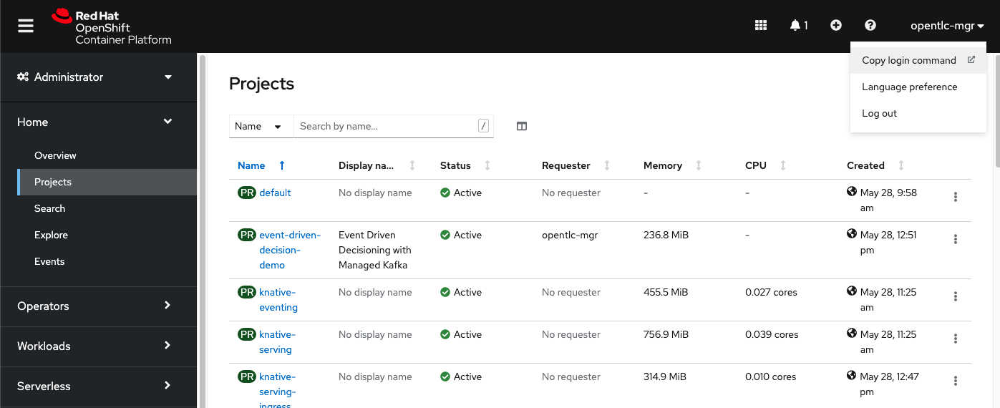
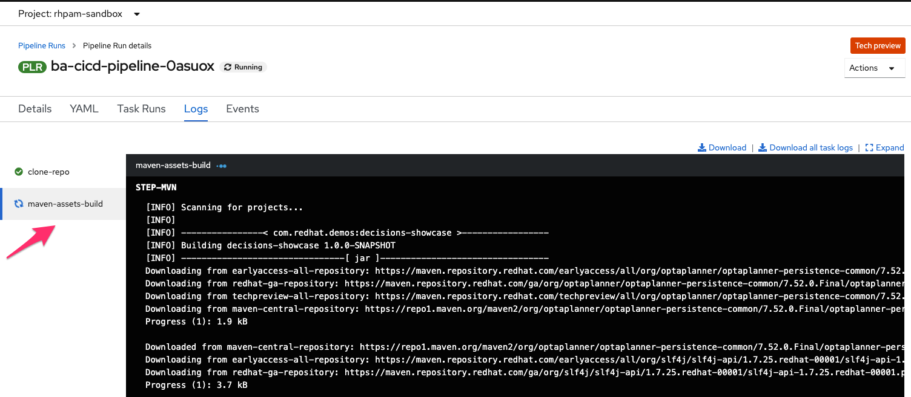

## Recognition Ruleset DMN

Description

A DMN service to return flight recognitions.

Demonstrates DMN on Kogito, including REST interface code generation.

## Installing and Running

### Prerequisites

You will need:

- Java 11+ installed
- Environment variable JAVA_HOME set accordingly
- Maven 3.8.1+ installed

When using native image compilation, you will also need:

- [GraalVM 19.3.1](https://github.com/oracle/graal/releases/tag/vm-19.3.1) installed
- Environment variable GRAALVM_HOME set accordingly
- Note that GraalVM native image compilation typically requires other packages (glibc-devel, zlib-devel and gcc) to be installed too. You also need 'native-image' installed in GraalVM (using 'gu install native-image'). Please refer to [GraalVM installation documentation](https://www.graalvm.org/docs/reference-manual/aot-compilation/#prerequisites) for more details.

### Compile and Run in Local Dev Mode

```
mvn clean compile quarkus:dev
```

### Package and Run in JVM mode

```
mvn clean package
java -jar target/quarkus-app/quarkus-run.jar
```

or on Windows

```
mvn clean package
java -jar target\quarkus-app\quarkus-run.jar
```

### Package and Run using Local Native Image

Note that this requires GRAALVM_HOME to point to a valid GraalVM installation

```
mvn clean package -Pnative
```

To run the generated native executable, generated in `target/`, execute

```
./target/dmn-quarkus-example-runner
```

Note: This does not yet work on Windows, GraalVM and Quarkus should be rolling out support for Windows soon.

## OpenAPI (Swagger) documentation

[Specification at swagger.io](https://swagger.io/docs/specification/about/)

You can take a look at the [OpenAPI definition](http://localhost:8080/openapi?format=json) - automatically generated and included in this service - to determine all available operations exposed by this service. For easy readability you can visualize the OpenAPI definition file using a UI tool like for example available [Swagger UI](https://editor.swagger.io).

In addition, various clients to interact with this service can be easily generated using this OpenAPI definition.

When running in either Quarkus Development or Native mode, we also leverage the [Quarkus OpenAPI extension](https://quarkus.io/guides/openapi-swaggerui#use-swagger-ui-for-development) that exposes [Swagger UI](http://localhost:8080/swagger-ui/) that you can use to look at available REST endpoints and send test requests.

## Test DMN Model using Maven

Validate the functionality of DMN models before deploying them into a production environment by defining test scenarios in Test Scenario Editor.

To define test scenarios you need to create a .scesim file inside your project and link it to the DMN model you want to be tested. Run all Test Scenarios, executing:

```sh
mvn clean test
```

See results in surefire test report `target/surefire-reports`

## Example Usage

Once the service is up and running, you can use the following example to interact with the service.

### POST /Flight_recognition

# Local address for testing

```
curl -X 'POST' 'http://localhost:8080/Flight_recognition' -H 'accept: application/json' -H 'Content-Type: application/json' \
    -d '{
        "Flight": {
            "Flight Carrier": "DL",
            "flight time": "09:30",
            "flight date": "2023-09-05",
            "distance": 580,
            "passengers": [
                {
                    "milestone multiple": 0,
                    "delay": true,
                    "is a 360 member": true,
                    "days since last Delta flight": 0,
                    "IROP severity level": 0,
                    "days since SkyMiles member": 0,
                    "days since new tier": 0,
                    "quarantined": true,
                    "medallion member": true,
                    "corporate flyer": true,
                    "military": false,
                    "age": 35,
                    "group booking size": 2,
                    "employee": false,
                    "unaccompanied minor": false,
                    "infant": false,
                    "skymiles member": true,
                    "seat": 22,
                    "last reveived recognition": "2021-02-17",
                    "million miler": false,
                    "status": "Diamond",
                    "missed connection": false,
                    "name": "Don Jones",
                    "last delta flight": "2023-01-28",
                    "days since last IROP": 0,
                    "hours since last misconnect": 2
                },
                {
                    "milestone multiple": 0,
                    "delay": true,
                    "is a 360 member": true,
                    "days since last Delta flight": 0,
                    "IROP severity level": 0,
                    "days since SkyMiles member": 0,
                    "days since new tier": 0,
                    "quarantined": false,
                    "medallion member": true,
                    "corporate flyer": true,
                    "military": false,
                    "age": 35,
                    "group booking size": 2,
                    "employee": false,
                    "unaccompanied minor": false,
                    "infant": false,
                    "skymiles member": true,
                    "seat": 22,
                    "last reveived recognition": "2021-02-17",
                    "million miler": false,
                    "status": "Diamond",
                    "missed connection": false,
                    "name": "Ron Jones",
                    "last delta flight": "2023-01-28",
                    "days since last IROP": 0,
                    "hours since last misconnect": 2
                },
                {
                    "milestone multiple": 0,
                    "delay": true,
                    "is a 360 member": true,
                    "days since last Delta flight": 0,
                    "IROP severity level": 0,
                    "days since SkyMiles member": 0,
                    "days since new tier": 1778,
                    "quarantined": false,
                    "medallion member": true,
                    "corporate flyer": true,
                    "military": false,
                    "age": 35,
                    "group booking size": 2,
                    "employee": false,
                    "unaccompanied minor": false,
                    "infant": false,
                    "skymiles member": true,
                    "seat": 10,
                    "last reveived recognition": "2022-09-05",
                    "million miler": false,
                    "status": "Gold",
                    "missed connection": true,
                    "name": "Jane Doe",
                    "last delta flight": "2023-06-15",
                    "days since last IROP": 15,
                    "hours since last misconnect": 19
                },
                {
                    "milestone multiple": 2,
                    "delay": false,
                    "is a 360 member": false,
                    "days since last Delta flight": 0,
                    "IROP severity level": 0,
                    "days since SkyMiles member": 0,
                    "days since new tier": 0,
                    "quarantined": false,
                    "medallion member": false,
                    "corporate flyer": false,
                    "military": false,
                    "age": 27,
                    "group booking size": 7,
                    "employee": false,
                    "unaccompanied minor": false,
                    "infant": false,
                    "skymiles member": true,
                    "seat": 46,
                    "last reveived recognition": "2022-09-05",
                    "million miler": false,
                    "status": "Silver",
                    "missed connection": false,
                    "name": "Sally Edwards",
                    "last delta flight": "2021-03-19",
                    "days since last IROP": 10,
                    "hours since last misconnect": 4
                }
            ]
        }
    }'
```

## Deploying with Kogito Operator

In the [`operator`](operator) directory you'll find the custom resources needed to deploy this example on OpenShift with the [Kogito Operator](https://docs.jboss.org/kogito/release/latest/html_single/#chap_kogito-deploying-on-openshift).

# Kogito DMN Provisioning and testing

## Pre-requisites

* OpenShift 4.6+ (with admin access to install operators)
* Git client on your local machine ( download at https://git-scm.com/downloads)
* GitHub account ( http://github.com/) 
* OpenShift oc client ([Where to download oc client](https://developers.redhat.com/openshift/command-line-tools))

## Demo Provisioning

### Preparing the environment

1. Log in to your OpenShift cluster in your terminal. You can copy the login command by using the option below in your OpenShift web UI.
	
2. Create an Openshift Project
   `oc new-project rhpam-sandbox`
3. Install OpenShift Pipelines Operator in your Cluster. 
   1. To install it, using the **Administrator View**, navigate to **Operators** -> **Operator** Hub menu. 
   2. In the text field, search for OpenShift Pipelines, select the Operator that will show up. 
       
   3. Click **Install**. On the next screen you can use the default values, and click on **Install** again.
4. While the operator is installing, fork and clone this repo to your local machine. Access the folder directory so we can start deploying the pipeline definitions.


### Creating the Tekton resources into your project namespace

1. Run the following oc command to create the pipeline resources:

```
$ oc create -f ./cicd/tekton-resources/ -n rhpam-sandbox

configmap/custom-maven-settings created
eventlistener.triggers.tekton.dev/kogito-event-listener created
persistentvolumeclaim/maven-repo-pvc created
task.tekton.dev/mvn-jkube created
task.tekton.dev/mvn created
pipeline.tekton.dev/kogito-pipeline created
persistentvolumeclaim/source-workspace-pvc created
triggerbinding.triggers.tekton.dev/kogito-trigger-binding created
triggertemplate.triggers.tekton.dev/kogito-trigger-template created	
```

The following resources should be created in your namespace:

* PVCs for maven and git repos
	* maven-repo-pvc
	* shared-workspace
* ConfigMap with a custom Maven settings.xml
* Tekton Resources
	* Event Listener
		> provides an addressable endpoint (the event sink). Trigger is referenced inside the EventListener Spec. It uses the extracted event parameters from each TriggerBinding (and any supplied static parameters) to create the resources specified in the corresponding TriggerTemplate. It also optionally allows an external service to pre-process the event payload via the interceptor field.

	* Triggers
		> in conjunction with pipelines enable us to hook our Pipelines to respond to external github events (push events, pull requests etc). It combines TriggerTemplate, TriggerBindings and interceptors.

	* TriggerTemplate
		> Templates resources to be created (e.g. Create PipelineResources and PipelineRun that uses them).

	* TriggerBinding
		> validates events and extracts payload fields

	* Tasks
		> a collection of Steps that you define and arrange in a specific order of execution as part of your continuous integration flow. A Task executes as a Pod on your Kubernetes cluster.

	* Pipeline
		> a collection of Tasks that you define and arrange in a specific order of execution as part of your continuous integration flow. Each Task in a Pipeline executes as a Pod on your Kubernetes cluster. You can configure various execution conditions to fit your business needs.

You can confirm this by opening the OpenShift Console using the Developer perspective, and accessing Pipelines menu. From the **Project** dropdown list, select `rhpam-sandbox`, then you should see the `kogito-pipeline`:


Click the `kogito-pipeline` to see its details with a graphical representation.


### Creating the webhook to trigger pipelines automatically

1. Expose the `Pipeline Event Listener`. In order to trigger a *Pipeline Run* with a *Git Push event* you need to expose your `Pipeline EventListener`:

```
$ oc expose svc el-kogito-event-listener -n rhpam-sandbox
route.route.openshift.io/el-kogito-event-listener exposed	
```

2. Open the Topology view in the Developer Dashboard to see the Trigger Event Listener POD

<p align="center">
  
</p>


This is the service that listens to your git hook events (via webhooks)!

3. Get your EventListener URL using the following command:

```
$ echo "$(oc  get route el-kogito-event-listener --template='http://{{.spec.host}}')"
http://el-kogito-event-listener-rhpam-sandbox.your.cluster.domain.com
```

#### Configuring GitHub Webhooks 
1. Open the your project's **Settings** in GitHub and access the **Webhooks** menu.
2. Click on the **Add Webhook** button and enter your password if requested.
   * Set the **Payload URL** with the **Pipeline EventListener** URL copied previously. 
   * Set the **Content type** as `application/json`
   * Once finished, click on the green button **Add Webhook**.
      

## Testing your environment

### Trigger the Pipeline execution

Let's do some changes on the project and push it to the git repository to see the pipeline in action. You can use VSCode and the Business Automation extension to support these next steps.

1. Open your decision service project in VSCode:
   `$ code decisions-showcase/`
3. Open a decision asset and change one of the values. For example, you can open the `Loan Approval.dmn` or the  `rulebase.drl` file under the resources folder, and update one of the rules' or decision's values. Save the file.
4. Adjust any unit tests accordingly to the changes below.
5. Back to the terminal (or using VScode Git extension), commit and push.

```
$ git add .
$ git commit -am "applying some changes"
$ git push origin master
```

5. Open GitHub UI, and in the project's **Settings**, under the **Webhooks** menu, you can confirm the **git push webhook** previously configured for your repo is activated. Click on your webhook and scroll down to see the recent deliveries. 
   

6. In OpenShift, you can confirm that consequently a new **Pipeline Run** was be triggered as well.
   

7. Using the Administrator Perspective, you can access **Pipelines** -> **Pipelines** ->**kogito-pipeline**  ->  **Pipeline Runs** tab to see your Pipeline executions
   

8. Click on the active execution to follow the run status:
	

9. Click on the `Logs` tab to see the output of each individual task execution
	


## Accessing the Business Application Service

At the end of the Pipeline execution you should have two instances of your Kie Server running on Spring Boot containers.


1. Click on the POD edge arrow to open the public App Route URL

<p align="center">
  
</p>

You should see the sample Business Application Service home page


exposing the standard Kie Server API *(user: wbadmin, passwd: wbadmin)*


## Build a custom Tekton Maven Task image
To be able to use JKube Maven Plugin I extended the standard Tekton Maven image to include the `oc` CLI tool.

```
docker build -f docker/mvn-with-oc-task.dockerfile \ 
--no-cache \ 
--build-arg OC_PKG_URL="https://mirror.openshift.com/pub/openshift-v4/clients/oc/latest/linux/oc.tar.gz" \
-t quay.io/rafaeltuelho/mvn-kube-oc:openjdk-11 .
```

> NOTE: this image is publicly available in my Quay.io repo: https://quay.io/repository/rafaeltuelho/mvn-kube-oc
> No need to do anything here.

## Clean up your namespace
To delete the application provisioned y the Pipeline Run, execute the following command.

```
oc delete all -l provider=jkube -n <namespace>

pod "business-application-service-1-9nl6j" deleted
pod "business-application-service-1-tnqth" deleted
replicationcontroller "business-application-service-1" deleted
service "business-application-service" deleted
deploymentconfig.apps.openshift.io "business-application-service" deleted
buildconfig.build.openshift.io "business-application-service-s2i" deleted
build.build.openshift.io "business-application-service-s2i-1" deleted
imagestream.image.openshift.io "business-application-service" deleted
route.route.openshift.io "business-application-service" deleted
```
